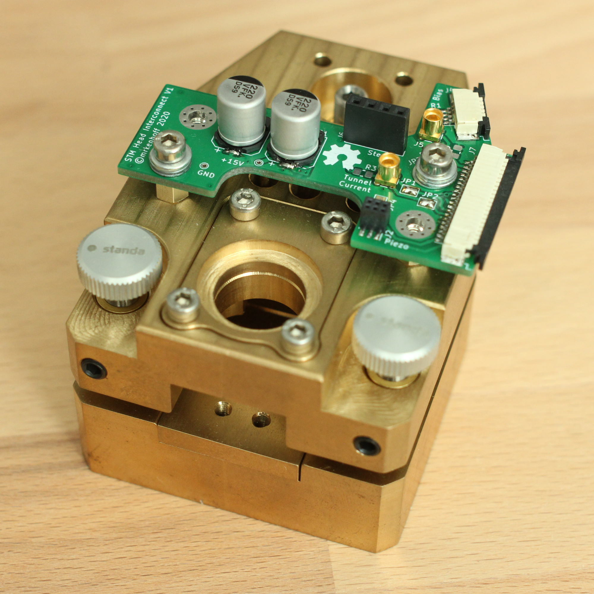
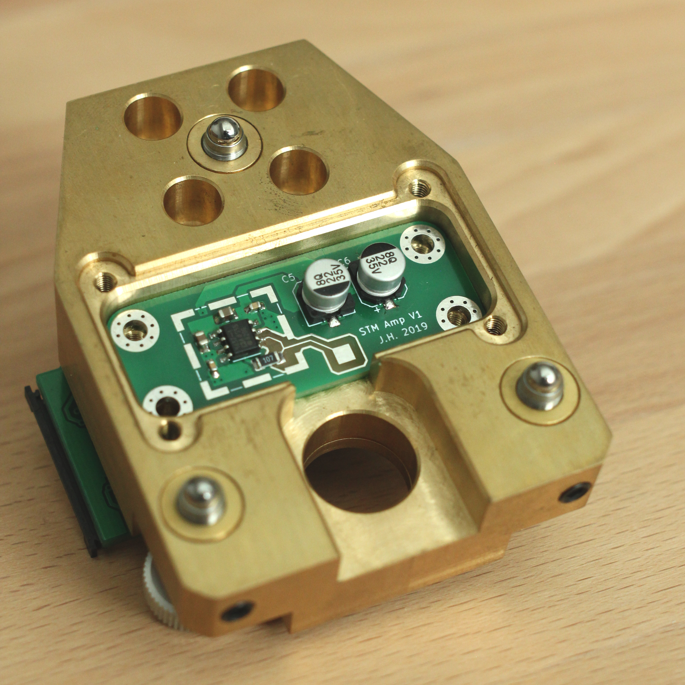

# Scanning tunneling microscope

# Table of Contents
- [Mechanics](#mechanics)
  - [Vibration Isolation](#vibration-isolation)
  - [Scan Head](#scan-head)
- [Electronics](#electronics)

# Mechanics

### Vibration Isolation
Mechanical vibrations present a major difficulty in scanning probe microscopy, as they can interfere with the very small (resolutions of a few 0.1 nm are not uncommon [1]) scanning movements of the tip, leading to a distorted image. Even worse, large mechanical vibrations can cause the scanning tip, which is usually positioned only a few Angstrom above the sample surface [2], to crash into the sample.

Unfortunately, there are many sources for mechanical vibrations: Driving cars, peoples walking around, wind blowing on the walls of your house and the subtle, but omnipresent seismic activity of the earth, just to name a few.
Especially since I'm living in a big City, good isolation of vibrations from the scanning head is essential.
To accomplish this, I use a stack of steel plates, separated using pieces of Viton o-rings. 
The material Viton was used, as it is reported to have a high damping coefficient, making it particularly usefull for vibration isolation [3]. This assembly can be described as a set of coupled damped mass-spring oscillators, which (if tuned correctly) provide an efficient way of decoupling mechanical vibrations. The vibration isolation should be designed to have the smallest possible resonance frequency (usually in the range of a couple Hz [*todo: citation*]), resulting in the desired attenuation of vibrations in the higher frequency range. The scanning head itself, which is mounted on the topmost steel plate, is designed to have the largest possible resonance frequency. This will guarantee, that any low frequency component that couple through the vibration isolation assembly will only shake the scanning head as a whole, and will not influence the relative position between the tip and the probe surface.

The figure below depicts an aluminium baseplate (150 mm diameter, 25 mm thickness), the vibration isolation assembly, consisting of three steel plates, each separated by three Viton o-ring cutouts, and the scanning head. The steel plates have a diameter of 100 mm and have an decreasing thickness of 15 mm, 12 mm and 8 mm. I have some spare plates lying around, so I will definately try out some other configurations as well. The plates are laser-cut - hence the terrible surface finish. I might clean them up on a lathe if I can get my hands on one at some point...
The complete depicted assembly can optionally be hung from some kind of support structure using steel springs or elastic rope, possibly further increasing the effectiveness of the vibration isolation. Since the baseplate is made of aluminium, additional eddy-current damping can be applied if needed.

- [1] C. Bai (2000). Scanning tunneling microscopy and its applications. New York: Springer Verlag. ISBN 978-3-540-65715-6.
- [2] C. Julian Chen (1993). Introduction to Scanning Tunneling Microscopy (PDF). Oxford University Press. ISBN 978-0-19-507150-4.
- [3] Oliva, Ai & Aguilar, Marilyn & Sosa, Victor. (1999). Low- and high-frequency vibration isolation for scanning probe microscopy. Measurement Science and Technology. 9. 383. 10.1088/0957-0233/9/3/011.

### Scan Head

# Electronics

### Tunneling Amp

